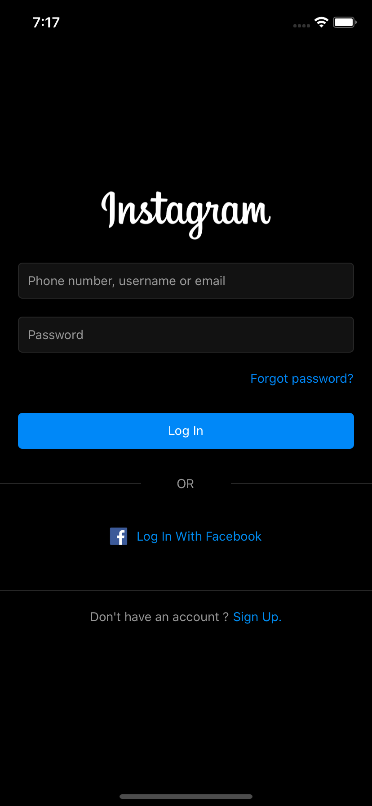
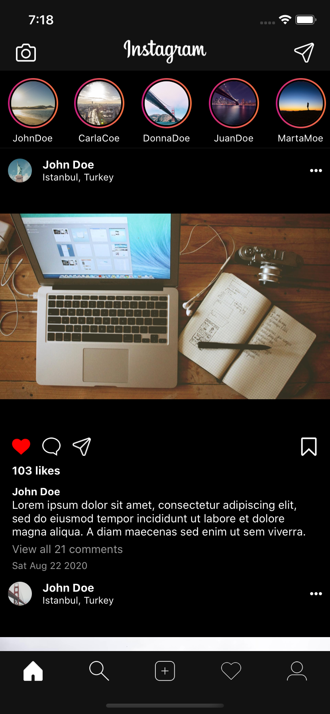
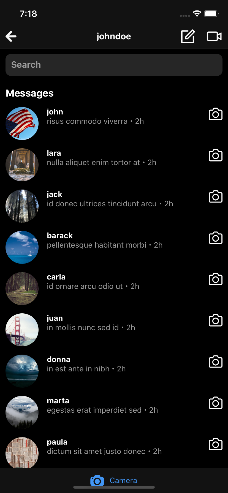
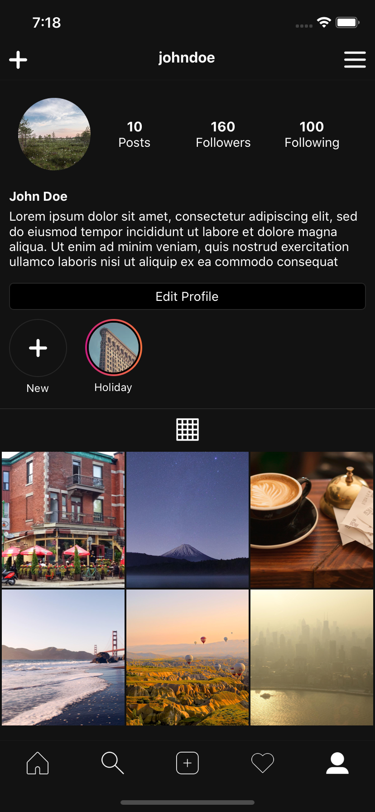
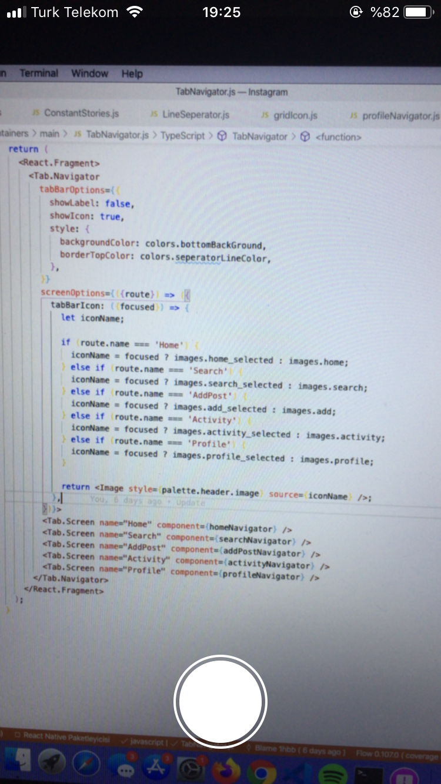

# React Native Instagram Clone
Instagram mobile app clone using React Native. I will add Activity screen and Add Pot screen in the future.

<table>
  <tr>
    <td></td>
    <td></td>
  <tr>
  <tr>
    <td></td>
    <td></td>
  <tr>
  <tr>
    <td></td>
    <td></td>
  <tr>
</table>

## How to use
- `git clone https://github.com/1hbb/react-native-instagram-clone.git`
- `cd Instagram`
- `npm install`
- `yarn install`
- `cd ios`
- `pod install` 
- `cd ..`
- `react-native run-ios` or `react-native run-android`

## Dependencies
- `@react-native-community/masked-view": "^0.1.10"`
- `@react-navigation/bottom-tabs": "^5.8.0"`
- `@react-navigation/native": "^5.7.3"`
- `@react-navigation/stack": "^5.9.0"`
- `react": "16.13.1"`
- `react-native": "0.63.2"`
- `react-native-camera": "^3.36.0"`
- `react-native-gesture-handler": "^1.7.0"`
- `react-native-linear-gradient": "^2.5.6"`
- `react-native-reanimated": "^1.10.2"`
- `react-native-safe-area-context": "^3.1.3"`
- `react-native-screens": "^2.10.1"`
- `react-native-webview": "^10.6.0"`
